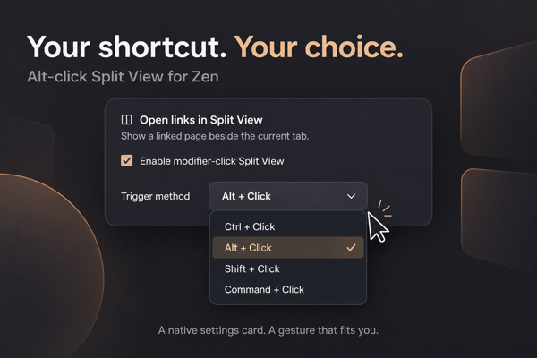

# Alt-click Split View

Follow a link without losing your place. Hold **Alt** and click a link to open it beside the page you are reading.



*Illustration of the added settings: an enable switch and a choice of click modifier. Marketplace preview: 600 × 400 pixels.*

- Compare an article with its sources or documentation with an example.
- Choose Alt, Ctrl, Shift, or Command as your modifier.
- Add pages to an existing Zen split, up to four panes.

When Glance and Split View are enabled with the same trigger, Tabs and browsing shows an error and Split View yields the gesture to Glance. Choose different modifiers or disable one feature. The warning updates live when either feature's preferences change.

Settings are available under **Tabs and browsing → Open links in Split View**, and in the mod's Sine Configure dialog. Both locations use the same preferences. Restart Zen after updating the development registration to load the settings script.

Alt-only primary clicks open a foreground pane through `gZenViewSplitter.openAndSwitchToTab()` and `splitTabs()`, the same methods used by Zen's Open This Link in Split View action. Existing splits gain another pane up to Zen's four-pane limit. Other clicks retain native behavior. Split panes are backed by tabs and saved by Zen.

Open the mod's settings in Sine to disable the behavior or choose Ctrl + Click, Alt + Click, Shift + Click, or Meta (Command) + Click. Firefox's separate `browser.tabs.splitView.enabled` preference is not required.

## Install with Sine

Add `kkugot/alt-click-split-view` through Sine's custom repository installation and enable the JavaScript when prompted. For a local or custom repository install, turn on Sine's **Enable installing JS from unofficial sources** setting (`sine.allow-unsafe-js`). Requires Sine with chrome script support. Runtime checked on Zen 1.22.1b and 1.22.2b on macOS. Store availability depends on Sine maintainer review.

If Glance already uses Alt + Click, choose a different modifier for one of the two features. The mod does not change Glance's settings automatically.

## Local development

From this checkout, register a symlink in a disposable Sine profile:

```sh
python3 scripts/install.py "/path/to/Zen/profile"
```

Restart Zen after installation. The installer refuses to replace an existing mod directory or a link to another checkout.

## Development

```sh
node --check alt-click-split-view.uc.js
node --test tests/alt-click-split-view.test.cjs
```

The runtime check in `tests/zen-runtime.py` uses a dedicated temporary Zen profile and Marionette. It exercises the parent click actor, the native tab-opening path, Split View creation, normal-click fallback, and unload restoration.

Author: Kostiantyn Kugot. MIT license.
